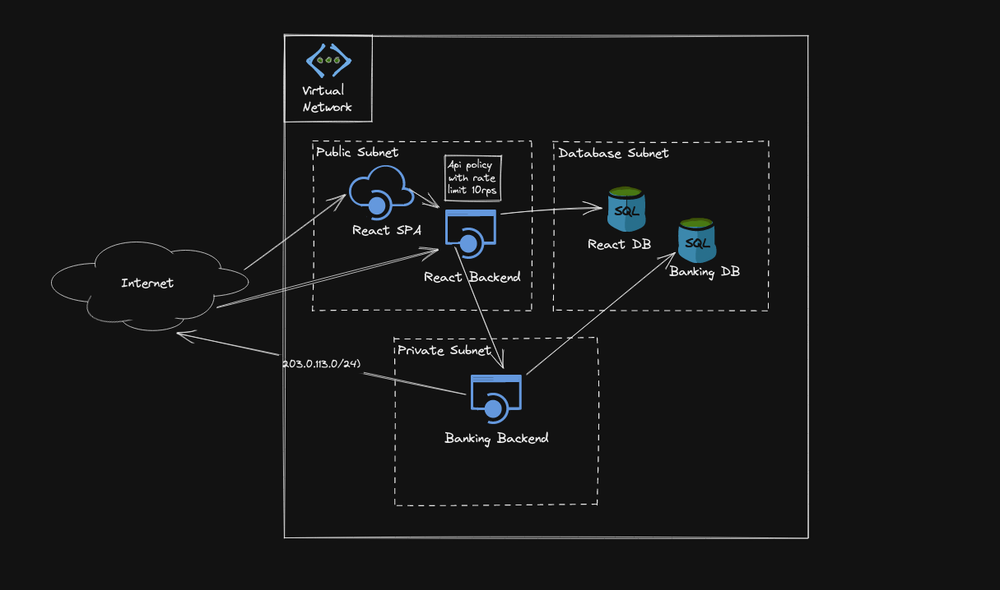

# azure-demo

## General setup
Schematic overview

## Networking
We have a virtual network in which we place our services.

The VN is divided into three subnets:

- Public Subnet
- Private subnet
- Database Subnet

There are security groups in place to secure the internal services and the databases.

### Public Subnet

In the public inbound and outbound traffic is not restricted.

### Private Subnet
In the private subnet inbound and outbound traffic is allowed to:
 - the banks public IP: 203.0.113.0/24
 - the database subnet for the DB port
 - the public subnet for the banking wrapper backend service
  
All other traffic is blocked
### Database Subnet
In the database subnet inbound and outbound traffic is allowed to:
 - the private subnet for the DB port
 - the public subnet for the DB port
All other traffic is blocked

## Services
We have 3 services set up in our solution:

- React Web App (SPA)
- Backend service for React
- Backend service wrapping the bank

### React Web App

The react app is set up using the LinuxWebApp Service, the code itself for now is just a .zip file in the infrastructure repo.

### Backend service for React

The backend service for React is implemented using the Azure container app service it has an API in front that esposes it to the public and implements a rate limit of 10 requests per second by policy.

### Backend bank wrapper

The bank-wrapping backend is implemented using the Azure container app service, it is not exposed to the public and has an API in front to serve calls from the React backend service.
I also has an API that serves webhook calls from the bank that is publicly accessible.

## Databases

There is one managed DB instance that hosts one database for each of the backend services.

## Improvements

### Secrets management

It would probably be a good idea to not expose the admin credentials for the DB instance in the code.
Instead a secret store solution should be used.
Same goes for the DB credentials themselves they should probably be kept in the secret store and injected in the containers of the backend apps in a secure way.

### Scalability/performance

The solution should be reviewed under the aspects of scalability performance regarding the size of the container apps and also the number of replicas running adding autoscaling/loadbalncing.
Also the sizing of the DB instances needs to be checked and read replicas added if needed.

### Redundancy

Currently the DBs run on one instance that is something that probably should be changed to decrease the blast radius in the error case(instance restore from snapshot)

### Testing

The current tests are not very meaningful and need to improved for instance everything that mustn't be public should be tested accordingly.
This should probably done by moving the the ressources from the stack to meaningful constructs like for the networking to improve testability.

### Deployment

Curently there is no deployment process in place, this could be a good starting point if github actions would be the tool of choice: https://github.com/hashicorp/terraform-cdk-action

